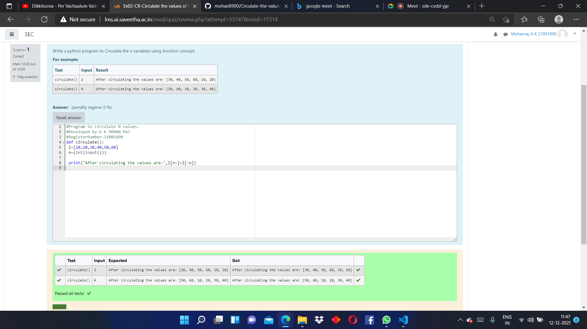

# Circulate-the-values-of-N-variables
## Aim:
To write a python program to circulate the n variables using function concept
## Equipment’s required:
PC
Anaconda - Python 3.7
## Algorithm: 
### Step 1:
to write a program for circulate the values of n variables
### Step 2:
 assign the value of second variables to a temporary variable
### Step 3: 
Get the value from the user for the number of rotation
### Step 4: 
Using the slicing concept rotate the list

### Step 5:
print both the values 
### Step 6:
end the program 
## Program:
```
#Program to circulate N values.
#Developed by:A K MOHAN RAJ 
#RegisterNumber:21001890
def circulate():
 l=[10,20,30,40,50,60]
 n=(int(input()))

 print("After circulating the values are:",l[n:]+l[:n])
 ```

## Output:


## Result:
thus the program is solved using python programming
